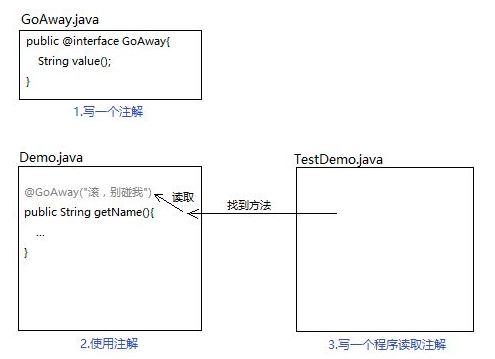
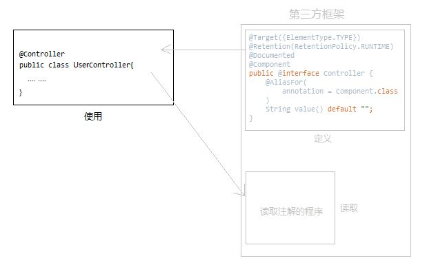

###Java注解

**什么是注解?**

- 我们都知道在Java代码中使用注释是为了提升代码的可读性，也就是说，注释是给人看的（对于编译器来说没有意义）。注解可以看做是注释的“强力升级版"，它可以向编译器、虚拟机等解释说明一些事情（也就是说它对编译器等工具也是“可读”的）。比如我们非常熟悉的@Override注解，它的作用是告诉编译器它所注解的方法是重写的父类中的方法，这样编译器就会去检查父类是否存在这个方法，以及这个方法的签名与父类是否相同。也就是说，注解是描述Java代码的代码，它能够被编译器解析，注解处理工具在运行时也能够解析注解。除了向编译器等传递一些信息，也可以使用注解生成代码。比如可以使用注解来描述我们的意图，然后让注解解析工具来解析注解，以此来生成一些”模板化“的代码。比如Hibernate、Spring等框架大量使用了注解，来避免一些重复的工作。注解是一种”被动“的信息，必须由编译器或虚拟机来“主动”解析它，它才能发挥自己的作用。


**为什么我们需要用到注解？**

- 传统的方式，我们是通过配置文件(xml文件)来告诉类是如何运行的,有了注解技术以后，我们就可以通过注解告诉类如何运行。例如：我们以前编写Servlet的时候，需要在web.xml文件配置具体的信息，使用了注解以后，可以直接在Servlet源代码上增加注解，Servlet就被配置到Tomcat上了。也就是说，**注解可以给类、方法上注入信息。**


**格式**：

```Java
public @interface 注解名称{
    属性列表;
}
```


**分类** ：

大致分为三类：自定义注解、JDK内置注解、还有第三方框架提供的注解。 

自定义注解就是我们自己写的注解。JDK内置注解，比如@Override检验方法重载，@Deprecated标识方法过期等。第三方框架定义的注解比如SpringMVC的@Controller等。


**使用位置**：

实际开发中，注解常常出现在类、方法、成员变量、形参位置


**级别**

注解和类、接口、枚举是同一级别的。


**注解的本质**

注解的本质是一个接口,但又和接口有很多差异，可以把它单独归为一类，不当成接口使用


**反射注解信息**：




常见的注解：

```java
public class AnnotationDemo {
    //@Test注解修饰方法A
    @Test
    public static void A(){
        System.out.println("Test.....");
    }

    //一个方法上可以拥有多个不同的注解
    @Deprecated
    @SuppressWarnings("uncheck")
    public static void B(){

    }
}
```

通过在方法上使用@Test注解后，在运行该方法时，测试框架会自动识别该方法并单独调用，@Test实际上是一种标记注解，起标记作用，运行时告诉测试框架该方法为测试方法。而对于@Deprecated和@SuppressWarnings(“uncheck”)，则是Java本身内置的注解，在代码中，可以经常看见它们，但这并不是一件好事，毕竟当方法或是类上面有@Deprecated注解时，说明该方法或是类都已经过期不建议再用，@SuppressWarnings 则表示忽略指定警告，比如@SuppressWarnings(“uncheck”)，这就是注解的最简单的使用方式


大多数情况下，我们只负责使用注解，无需定义和执行，框架会将注解类和读取注解的程序隐藏起来，除非阅读源码，才能看到

