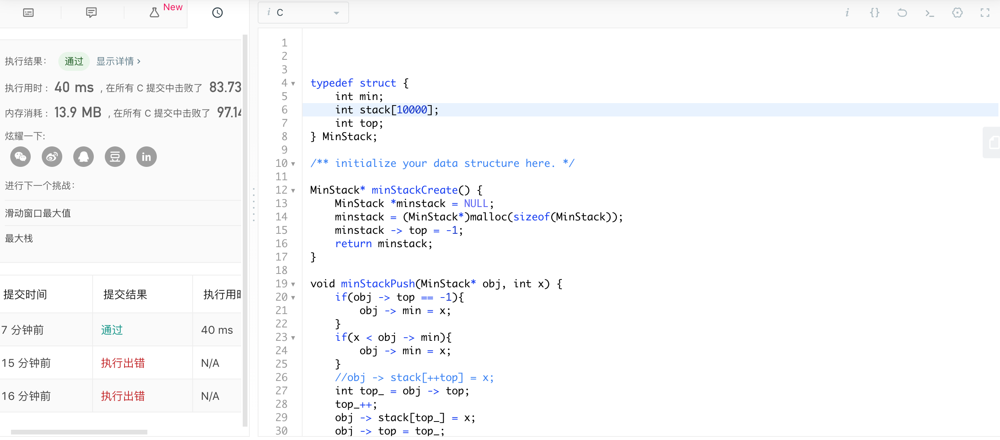

###day1 最小栈

在push和pop的时候，需要注意最小元素的变化，检索最小元素使用了冒泡排序。

```c
typedef struct {
    int min;
    int stack[10000];
    int top;
} MinStack;

/** initialize your data structure here. */

MinStack* minStackCreate() {
    MinStack *minstack = NULL;
    minstack = (MinStack*)malloc(sizeof(MinStack));
    minstack -> top = -1;
    return minstack;    
}

void minStackPush(MinStack* obj, int x) {
    if(obj -> top == -1){
        obj -> min = x;
    }
    if(x < obj -> min){
        obj -> min = x;
    }
    //obj -> stack[++top] = x;
    int top_ = obj -> top;
    top_++;
    obj -> stack[top_] = x;
    obj -> top = top_;
}

void minStackPop(MinStack* obj) {
    if(obj -> top == -1){
        return;
    }
    int oldtop = obj -> top; 
    //如果删除的栈顶元素是最小的
    if(obj -> min == obj ->stack[oldtop]){
        obj -> min = obj ->stack[0];
        for(int i = 1; i < oldtop; i++){
            if(obj -> stack[i] < obj -> min){
                obj -> min = obj -> stack[i];
            }
        }
    }
	obj -> top = oldtop - 1;
}

int minStackTop(MinStack* obj) {
    int top_ = obj -> top;
    return obj -> stack[top_];
}

int minStackGetMin(MinStack* obj) {
    return obj -> min;
}

void minStackFree(MinStack* obj) {
    obj -> top = -1;
}

/**

- Your MinStack struct will be instantiated and called as such:
- MinStack* obj = minStackCreate();
- minStackPush(obj, x);
- minStackPop(obj);
- int param_3 = minStackTop(obj);
- int param_4 = minStackGetMin(obj);
- minStackFree(obj);
  */
```



