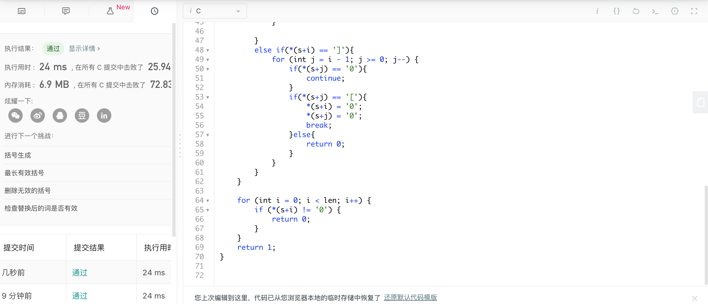

### day2 有效的括号

题目：给定一个只包括 `'('`，`')'`，`'{'`，`'}'`，`'['`，`']'` 的字符串，判断字符串是否有效。

有效字符串需满足：

1. 左括号必须用相同类型的右括号闭合。
2. 左括号必须以正确的顺序闭合。

注意空字符串可被认为是有效字符串。

**示例 1:**

```
输入: "()"
输出: true
```

**示例 2:**

```
输入: "()[]{}"
输出: true
```

**示例 3:**

```
输入: "(]"
输出: false
```

**示例 4:**

```
输入: "([)]"
输出: false
```

**示例 5:**

```
输入: "{[]}"
输出: true
```

---

```c
bool isValid(char * s){
    int stack[10000];
    int top = -1;
    int len = (int)strlen(s);
    for (int i = 0; i < len; i++) {
        if (*(s+i) == '(') {
            stack[++top] = '(';
        }
        else if(*(s+i) == '{'){
            stack[++top] = '{';
        }
        else if(*(s+i) == '['){
            stack[++top] = '[';
        }
        
        if (*(s+i) == ')') {
            for (int j = i - 1; j >= 0; j--) {
                if(*(s+j) == '0'){
                    continue;
                }
                if(*(s+j) == '('){
                    *(s+i) = '0';
                    *(s+j) = '0';
                    break;
                }else{
                    return 0;
                }
            }
            
        }
        else if(*(s+i) == '}'){
            for (int j = i - 1; j >= 0; j--) {
                if(*(s+j) == '0'){
                    continue;
                }
                if(*(s+j) == '{'){
                    *(s+i) = '0';
                    *(s+j) = '0';
                    break;
                }else{
                    return 0;
                }
            }
            
        }
        else if(*(s+i) == ']'){
            for (int j = i - 1; j >= 0; j--) {
                if(*(s+j) == '0'){
                    continue;
                }
                if(*(s+j) == '['){
                    *(s+i) = '0';
                    *(s+j) = '0';
                    break;
                }else{
                    return 0;
                }
            }
        }
    }
    
    for (int i = 0; i < len; i++) {
        if (*(s+i) != '0') {
            return 0;
        }
    }
    return 1;
}
```

大致思路如下：

从头遍历字符串，如果遇到左括号就入栈，如果遇到右括号，则向左查找遇到的第一个括号（过滤‘0’），如果匹配，就把这两个括号在栈中的值设为‘0’，表示已经配对过，如果不匹配，就可以返回false了。到最后遍历完，如果整个栈的值都为‘0’，那么返回true。

