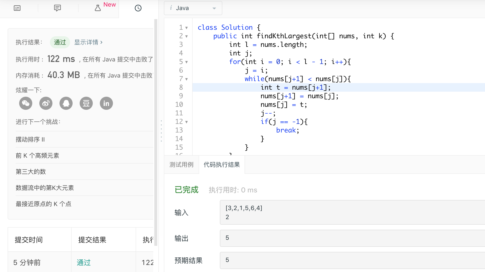

###day3 数组中的第k个最大元素

题目描述：

在未排序的数组中找到第 k 个最大的元素。请注意，你需要找的是数组排序后的第 k 个最大的元素，而不是第 k 个不同的元素。

- 示例 1:

​	输入: [3,2,1,5,6,4] 和 k = 2
​	输出: 5

- 示例 2:

​	输入: [3,2,3,1,2,4,5,5,6] 和 k = 4
​	输出: 4
​	说明:

你可以假设 k 总是有效的，且 1 ≤ k ≤ 数组的长度。

---

大致思路：一开始想复杂了，后来发现只需要排序一下即可。但是算法的时间和空间排名比较靠后，需要看下别的小伙伴的思路，想想如何优化。

```java
class Solution {
    public int findKthLargest(int[] nums, int k) {
        int l = nums.length;
        int j;
        for(int i = 0; i < l - 1; i++){
            j = i;
            while(nums[j+1] < nums[j]){
                int t = nums[j+1];
                nums[j+1] = nums[j];
                nums[j] = t;
                j--;
                if(j == -1){
                    break;
                }
            }
        }
        return nums[l-k];
    }
}
```

