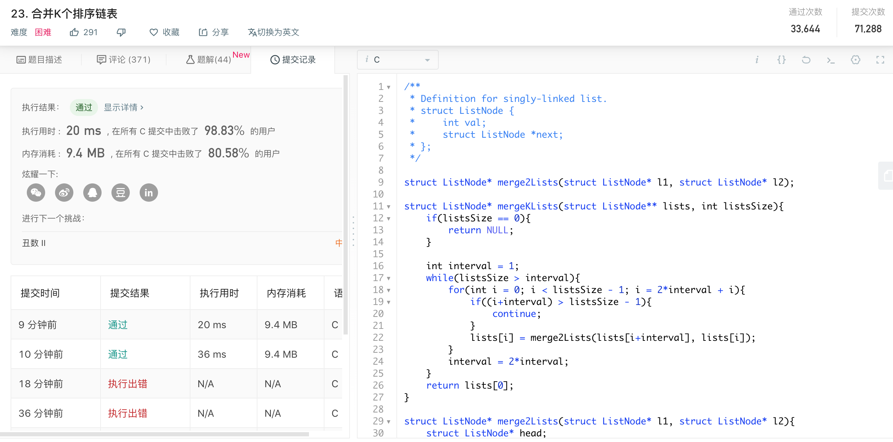

###day4 合并k个排序链表

题目描述：

合并 k 个排序链表，返回合并后的排序链表。请分析和描述算法的复杂度。

示例:

> 输入:
> [
>   1->4->5,
>   1->3->4,
>   2->6
> ]
> 输出: 1->1->2->3->4->4->5->6

---

大致思路：

先解决合并两个排序链表的问题，然后用分治法。写的过程中遇到了很多bug，自己基础还是需要继续加强，不过最后终于还是通过了。

遇到的几个小问题记录一下：

1，leetcode上用C语言时，如果新建了函数，要记得在前面声明。

2，多考虑特殊情况。

3，用到数组的时候，就要考虑会不会存在越界的问题。

4，算法的思想其实很简单，拿笔在纸上推演一遍再动手写。

5，遇到bug在本地断掉调试，可以方便地找到问题所在。

```c
/**
 * Definition for singly-linked list.
 * struct ListNode {
 *     int val;
 *     struct ListNode *next;
 * };
 */

struct ListNode* merge2Lists(struct ListNode* l1, struct ListNode* l2);

struct ListNode* mergeKLists(struct ListNode** lists, int listsSize){
    if(listsSize == 0){
        return NULL;
    }

    int interval = 1;
    while(listsSize > interval){
        for(int i = 0; i < listsSize - 1; i = 2*interval + i){
            if((i+interval) > listsSize - 1){
                continue;
            }
            lists[i] = merge2Lists(lists[i+interval], lists[i]);
        }
        interval = 2*interval;
    }
    return lists[0];
}

struct ListNode* merge2Lists(struct ListNode* l1, struct ListNode* l2){
    struct ListNode* head;
    struct ListNode* l;
    struct ListNode* s;
    int k = 0;
    
    //处理特殊情况
    if(l1 == NULL){
        return l2;
    }else if (l2 == NULL){
        return l1;
    }
    
    //把较长的链表作为返回的结果
    if(sizeof(l1) > sizeof(l2)){
        l = l1;
        s = l2;
        head = l;
    }else{
        if(l1 -> val <= l2 -> val){
            k = 1;
        }
        l = l2;
        s = l1;
        head = l;
    }
    
    //遍历short
    while(s != NULL){
        if(s -> val < l -> val){
            //直接插到前面
            struct ListNode* q = s;
            s = s -> next;
            q -> next = l;
            l = q;
            if(k == 1){
                head = l;
            }
        }else{
            k = 0;
            //如果链表已经到最后了
            if(l -> next == NULL){
                l -> next = s;
                return head;
            }
            
            if(s -> val > l -> next -> val){
                l = l -> next;
            }else{
                //插在l的下一个结点   
                struct ListNode* p = s;
                s = s -> next;
                p -> next = l -> next;
                l -> next = p;
                l = l -> next;
            }
        }
    }
    return head;
}
```

