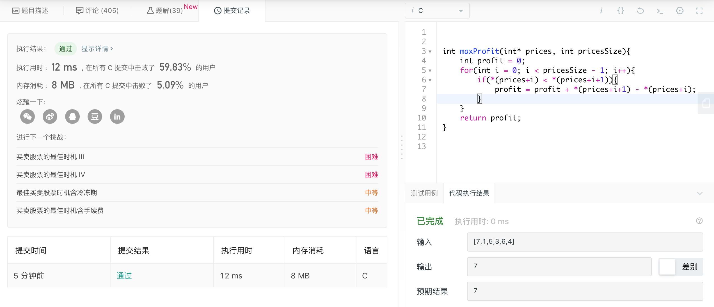

###day5 买卖股票的最佳时机 II

题目描述：

> 给定一个数组，它的第 i 个元素是一支给定股票第 i 天的价格。设计一个算法来计算你所能获取的最大利润。你可以尽可能地完成更多的交易（多次买卖一支股票）。注意：你不能同时参与多笔交易（你必须在再次购买前出售掉之前的股票）。
>
> 示例 1:输入: [7,1,5,3,6,4]
> 输出: 7
> 解释: 在第 2 天（股票价格 = 1）的时候买入，在第 3 天（股票价格 = 5）的时候卖出, 这笔交易所能获得利润 = 5-1 = 4 。
>      随后，在第 4 天（股票价格 = 3）的时候买入，在第 5 天（股票价格 = 6）的时候卖出, 这笔交易所能获得利润 = 6-3 = 3 。

---

一开始感觉还挺复杂，想了想发现很简单，因为当天是可以卖出或继续持有的，已经知道了第二天的涨和跌，只需要保证当下利润最大即可。

```c
int maxProfit(int* prices, int pricesSize){
    int profit = 0;
    for(int i = 0; i < pricesSize - 1; i++){
        if(*(prices+i) < *(prices+i+1)){
            profit = profit + *(prices+i+1) - *(prices+i);
        }
    }
    return profit;
}
```

但是不知道为什么内存消耗比95%的人都高，看看其他伙伴的解法。

