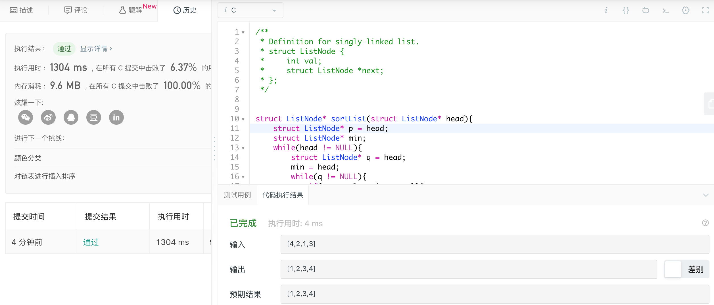

### day6 排序链表

题目描述：

在 O(n log n) 时间复杂度和常数级空间复杂度下，对链表进行排序。

> 示例 1:
>
> 输入: 4->2->1->3
> 输出: 1->2->3->4
>
> 示例 2:
>
> 输入: -1->5->3->4->0
> 输出: -1->0->3->4->5

---

大致思路：

遍历，找到val最小的，和前面排过序的下一个交换值

```c
/**
 * Definition for singly-linked list.
 * struct ListNode {
 *     int val;
 *     struct ListNode *next;
 * };
 */
struct ListNode* sortList(struct ListNode* head){
    struct ListNode* p = head;
    struct ListNode* min;
    while(head != NULL){
        struct ListNode* q = head;
        min = head;
        while(q != NULL){
            if(q -> val < min -> val){
                min = q;
            }
            q = q ->next;
        }
        //交换head和min的值，head往下继续走
        int t = head -> val;
        head -> val = min -> val;
        min -> val = t;
        head = head -> next;
    }
    return p;
}
```

