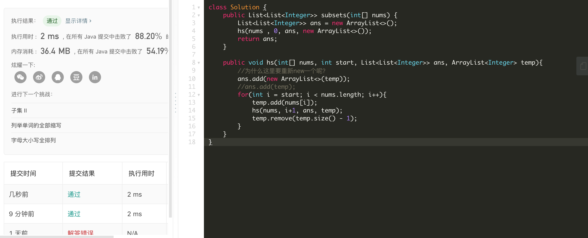

### Day7 子集

题目描述：

>给定一组不含重复元素的整数数组 nums，返回该数组所有可能的子集（幂集）。
>
>说明：解集不能包含重复的子集。
>
>示例:
>
>输入: nums = [1,2,3]
>输出:
>[
>  [3],
>  [1],
>  [2],
>  [1,2,3],
>  [1,3],
>  [2,3],
>  [1,2],
>  []
>]

大致思路：

回溯法。理解不深。

```Java
class Solution {
    public List<List<Integer>> subsets(int[] nums) {
        List<List<Integer>> ans = new ArrayList<>();
        hs(nums , 0, ans, new ArrayList<>());
        return ans;
    }
    
    public void hs(int[] nums, int start, List<List<Integer>> ans, ArrayList<Integer> temp){
        //为什么这里要重新new一个呢？
        ans.add(new ArrayList<>(temp));
        //ans.add(temp);
        for(int i = start; i < nums.length; i++){
            temp.add(nums[i]);
            hs(nums, i+1, ans, temp);
            temp.remove(temp.size() - 1);
        }
    }
}
```

