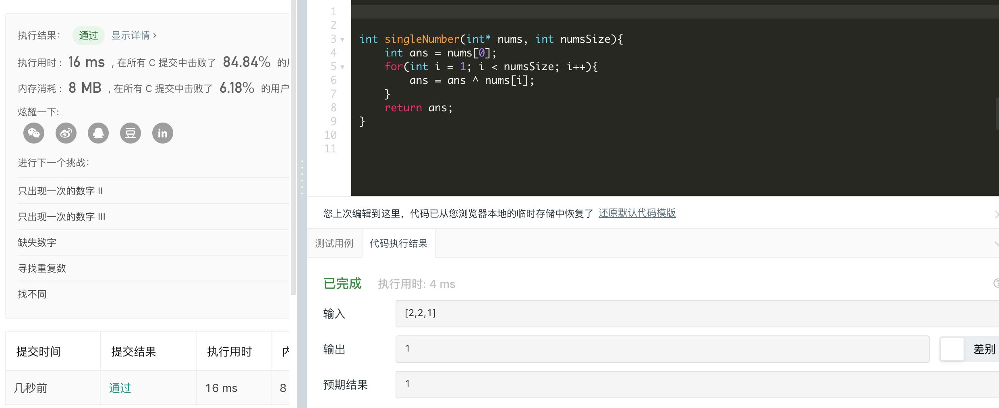

### 只出现一次的数字

题目描述：

>给定一个**非空**整数数组，除了某个元素只出现一次以外，其余每个元素均出现两次。找出那个只出现了一次的元素。
>
>**说明：**
>
>你的算法应该具有线性时间复杂度。 你可以不使用额外空间来实现吗？
>
>**示例 1:**
>
>```
>输入: [2,2,1]
>输出: 1
>```
>
>**示例 2:**
>
>```
>输入: [4,1,2,1,2]
>输出: 4
>```

思路：

解法一：暴力解法。

```c
int singleNumber(int* nums, int numsSize){
    int f,t;
    int c = 0;
    for(int i = 0; i < numsSize; i++){
        f = *(nums+i);
        for(int j = 0; j < numsSize; j++){
            if(j == i)
                continue;
            if(*(nums+i) == *(nums+j)){
                c++;
            }
        }
        if(c == 0)
            return *(nums+i);
        else
            c = 0;
    }
    return 0;
}
```

解法二：

位运算，异或。异或运算两次，值不变。

异或运算法则

　　1. a ^ b = b ^ a 
　　2. a ^ b ^ c = a ^ (b ^ c) = (a ^ b) ^ c; 
　　3. d = a ^ b ^ c 可以推出 a = d ^ b ^ c. 
　　4. a ^ b ^ a = b.

```c
int singleNumber(int* nums, int numsSize){
    int ans = nums[0];
    for(int i = 1; i < numsSize; i++){
        ans = ans ^ nums[i]; 
    }
    return ans;   
}
```



