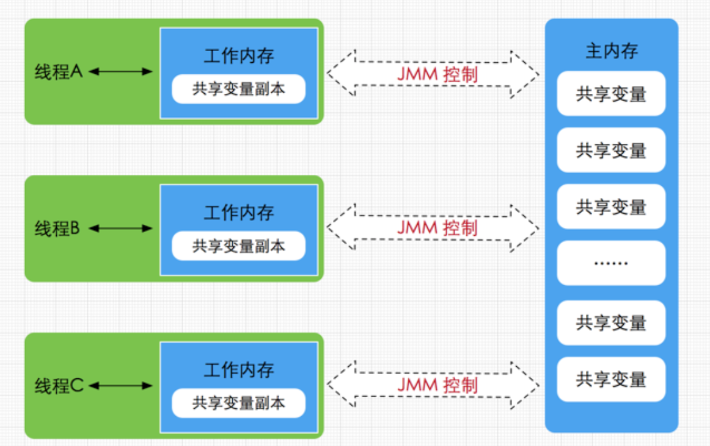
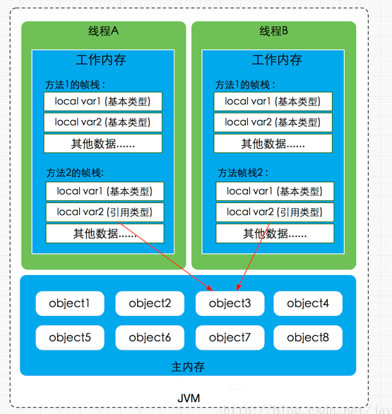
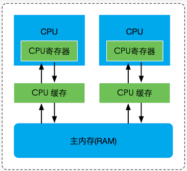
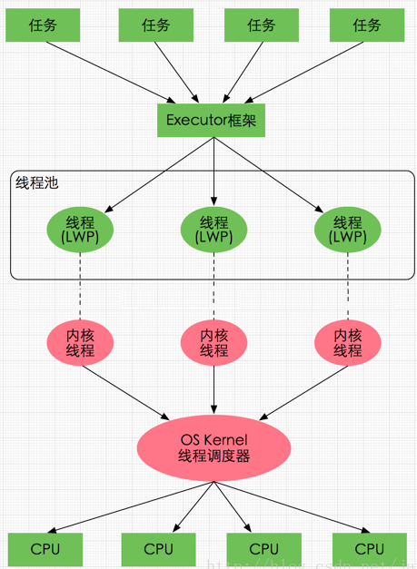
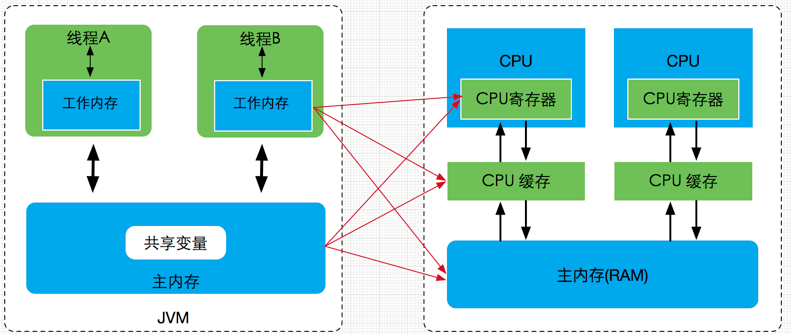
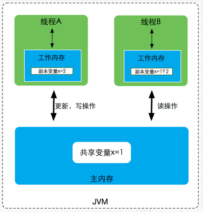

###Java内存区域：

Java虚拟机在运行程序时会把其自动管理的内存划分为五个区域，每个区域都有的用途以及创建销毁的时机。

- 所有线程共享的数据区域

**方法区**：

> 方法区属于线程共享的内存区域，又称Non-Heap（非堆），主要用于存储已被虚拟机加载的类信息、常量、静态变量、即时编译器编译后的代码等数据，根据Java 虚拟机规范的规定，当方法区无法满足内存分配需求时，将抛出OutOfMemoryError 异常。值得注意的是在方法区中存在一个叫运行时常量池(Runtime Constant Pool）的区域，它主要用于存放编译器生成的各种字面量和符号引用，这些内容将在类加载后存放到运行时常量池中，以便后续使用。

**JVM堆**：

> Java 堆也是属于线程共享的内存区域，它在虚拟机启动时创建，是Java 虚拟机所管理的内存中最大的一块，主要用于存放对象实例，几乎所有的对象实例都在这里分配内存，注意Java 堆是垃圾收集器管理的主要区域，因此很多时候也被称做GC 堆，如果在堆中没有内存完成实例分配，并且堆也无法再扩展时，将会抛出OutOfMemoryError 异常。

---

- 每个线程的私有数据区域

**程序计数器**：

> 属于线程私有的数据区域，是一小块内存空间，主要代表当前线程所执行的字节码行号指示器。字节码解释器工作时，通过改变这个计数器的值来选取下一条需要执行的字节码指令，分支、循环、跳转、异常处理、线程恢复等基础功能都需要依赖这个计数器来完成。

**虚拟机栈**：

> 属于线程私有的数据区域，与线程同时创建，总数与线程关联，代表Java方法执行的内存模型。每个方法执行时都会创建一个栈桢来存储方法的的变量表、操作数栈、动态链接方法、返回值、返回地址等信息。每个方法从调用直结束就对于一个栈桢在虚拟机栈中的入栈和出栈过程，

**本地方法栈**：

> 本地方法栈属于线程私有的数据区域，这部分主要与虚拟机用到的 Native 方法相关，一般情况下，我们无需关心此区域。

---

###Java内存模型：

Java内存模型(即Java Memory Model，简称JMM)本身是一种抽象的概念，并不真实存在，它描述的是一组规则或规范，通过这组规范定义了程序中各个变量（包括实例字段，静态字段和构成数组对象的元素）的访问方式。由于JVM运行程序的实体是线程，而每个线程创建时JVM都会为其创建一个工作内存(有些地方称为栈空间)，用于存储线程私有的数据，而Java内存模型中规定所有变量都存储在主内存，主内存是共享内存区域，所有线程都可以访问，但线程对变量的操作(读取赋值等)必须在工作内存中进行，首先要将变量从主内存拷贝的自己的工作内存空间，然后对变量进行操作，操作完成后再将变量写回主内存，不能直接操作主内存中的变量，工作内存中存储着主内存中的变量副本拷贝，工作内存是每个线程的私有数据区域，因此不同的线程间无法访问对方的工作内存，线程间的通信(传值)必须通过主内存来完成，其简要访问过程如下图

JMM与Java内存区域的划分是不同的概念层次，更恰当说JMM描述的是一组规则，通过这组规则控制程序中各个变量在共享数据区域和私有数据区域的访问方式，JMM是围绕原子性，有序性、可见性展开的(稍后会分析)。JMM与Java内存区域唯一相似点，都存在共享数据区域和私有数据区域，在JMM中主内存属于共享数据区域，从某个程度上讲应该包括了堆和方法区，而工作内存数据线程私有数据区域，从某个程度上讲则应该包括程序计数器、虚拟机栈以及本地方法栈。或许在某些地方，我们可能会看见主内存被描述为堆内存，工作内存被称为线程栈，实际上他们表达的都是同一个含义。

####关于JMM中的主内存和工作内存:

**主内存**

- 主要存储的是Java实例对象，所有线程创建的实例对象都存放在主内存中，不管该实例对象是成员变量还是方法中的本地变量(也称局部变量)，当然也包括了共享的类信息、常量、静态变量。由于是共享数据区域，多条线程对同一个变量进行访问可能会发现线程安全问题。

**工作内存**

- 主要存储当前方法的所有本地变量信息(工作内存中存储着主内存中的变量副本拷贝)，每个线程只能访问自己的工作内存，即线程中的本地变量对其它线程是不可见的，就算是两个线程执行的是同一段代码，它们也会各自在自己的工作内存中创建属于当前线程的本地变量，当然也包括了字节码行号指示器、相关Native方法的信息。由于工作内存是每个线程的私有数据，线程间无法相互访问工作内存，因此存储在工作内存的数据不存在线程安全问题。

####主内存与工作内存的数据存储类型以及操作方式

- 根据虚拟机规范，对于一个实例对象中的成员方法而言，如果方法中包含本地变量是基本数据类型（boolean,byte,short,char,int,long,float,double），将直接存储在工作内存的帧栈结构中，但倘若本地变量是引用类型，那么该变量的引用会存储在功能内存的帧栈中，而对象实例将存储在主内存(共享数据区域，堆)中。但对于实例对象的成员变量，不管它是基本数据类型或者包装类型(Integer、Double等)还是引用类型，都会被存储到堆区。至于static变量以及类本身相关信息将会存储在主内存中。需要注意的是，在主内存中的实例对象可以被多线程共享，倘若两个线程同时调用了同一个对象的同一个方法，那么两条线程会将要操作的数据拷贝一份到自己的工作内存中，执行完成操作后才刷新到主内存

###硬件内存架构与Java内存模型：

经过简化CPU与内存操作的简易图，为了理解方便，省去了南北桥并将三级缓存统一为CPU缓存(有些CPU只有二级缓存，有些CPU有三级缓存)。就目前计算机而言，一般拥有多个CPU并且每个CPU可能存在多个核心，多核是指在一枚处理器(CPU)中集成两个或多个完整的计算引擎(内核),这样就可以支持多任务并行执行，从多线程的调度来说，每个线程都会映射到各个CPU核心中并行运行。在CPU内部有一组CPU寄存器，寄存器是cpu直接访问和处理的数据，是一个临时放数据的空间。一般CPU都会从内存取数据到寄存器，然后进行处理，但由于内存的处理速度远远低于CPU，导致CPU在处理指令时往往花费很多时间在等待内存做准备工作，于是在寄存器和主内存间添加了CPU缓存，CPU缓存比较小，但访问速度比主内存快得多，如果CPU总是操作主内存中的同一址地的数据，很容易影响CPU执行速度，此时CPU缓存就可以把从内存提取的数据暂时保存起来，如果寄存器要取内存中同一位置的数据，直接从缓存中提取，无需直接从主内存取。需要注意的是，寄存器并不每次数据都可以从缓存中取得数据，万一不是同一个内存地址中的数据，那寄存器还必须直接绕过缓存从内存中取数据。所以并不每次都得到缓存中取数据，这种现象有个专业的名称叫做缓存的命中率，从缓存中取就命中，不从缓存中取从内存中取，就没命中，可见缓存命中率的高低也会影响CPU执行性能，这就是CPU、缓存以及主内存间的简要交互过程，总而言之当一个CPU需要访问主存时，会先读取一部分主存数据到CPU缓存(当然如果CPU缓存中存在需要的数据就会直接从缓存获取)，进而在读取CPU缓存到寄存器，当CPU需要写数据到主存时，同样会先刷新寄存器中的数据到CPU缓存，然后再把数据刷新到主内存中。

####Java线程与硬件处理器：

了解完硬件的内存架构后，接着了解JVM中线程的实现原理，理解线程的实现原理，有助于我们了解Java内存模型与硬件内存架构的关系，在Window系统和Linux系统上，Java线程的实现是基于一对一的线程模型，所谓的一对一模型，实际上就是通过语言级别层面程序去间接调用系统内核的线程模型，即我们在使用Java线程时，Java虚拟机内部是转而调用当前操作系统的内核线程来完成当前任务。这里需要了解一个术语，内核线程(Kernel-Level Thread，KLT)，它是由操作系统内核(Kernel)支持的线程，这种线程是由操作系统内核来完成线程切换，内核通过操作调度器进而对线程执行调度，并将线程的任务映射到各个处理器上。每个内核线程可以视为内核的一个分身,这也就是操作系统可以同时处理多任务的原因。由于我们编写的多线程程序属于语言层面的，程序一般不会直接去调用内核线程，取而代之的是一种轻量级的进程(Light Weight Process)，也是通常意义上的线程，由于每个轻量级进程都会映射到一个内核线程，因此我们可以通过轻量级进程调用内核线程，进而由操作系统内核将任务映射到各个处理器，这种轻量级进程与内核线程间1对1的关系就称为一对一的线程模型

####Java内存模型与硬件内存架构的关系

通过对前面的硬件内存架构、Java内存模型以及Java多线程的实现原理的了解，我们应该已经意识到，多线程的执行最终都会映射到硬件处理器上进行执行，但Java内存模型和硬件内存架构并不完全一致。对于硬件内存来说只有寄存器、缓存内存、主内存的概念，并没有工作内存(线程私有数据区域)和主内存(堆内存)之分，也就是说Java内存模型对内存的划分对硬件内存并没有任何影响，因为JMM只是一种抽象的概念，是一组规则，并不实际存在，不管是工作内存的数据还是主内存的数据，对于计算机硬件来说都会存储在计算机主内存中，当然也有可能存储到CPU缓存或者寄存器中，因此总体上来说，Java内存模型和计算机硬件内存架构是一个相互交叉的关系，是一种抽象概念划分与真实物理硬件的交叉。(对于Java内存区域划分也是同样的道理)

####JMM存在的必要性

由于JVM运行程序的实体是线程，而每个线程创建时JVM都会为其创建一个工作内存(有些地方称为栈空间)，用于存储线程私有的数据，线程与主内存中的变量操作必须通过工作内存间接完成，主要过程是将变量从主内存拷贝到每个线程各自的工作内存空间，然后对变量进行操作，操作完成后再将变量写回主内存，如果存在两个线程同时对一个主内存中的实例对象的变量进行操作就有可能诱发线程安全问题。如下图，主内存中存在一个共享变量x，现在有A和B两条线程分别对该变量x=1进行操作，A/B线程各自的工作内存中存在共享变量副本x。假设现在A线程想要修改x的值为2，而B线程却想要读取x的值，那么B线程读取到的值是A线程更新后的值2还是更新前的值1呢？答案是，不确定，即B线程有可能读取到A线程更新前的值1，也有可能读取到A线程更新后的值2，这是因为工作内存是每个线程私有的数据区域，而线程A变量x时，首先是将变量从主内存拷贝到A线程的工作内存中，然后对变量进行操作，操作完成后再将变量x写回主内，而对于B线程的也是类似的，这样就有可能造成主内存与工作内存间数据存在一致性问题，假如A线程修改完后正在将数据写回主内存，而B线程此时正在读取主内存，即将x=1拷贝到自己的工作内存中，这样B线程读取到的值就是x=1，但如果A线程已将x=2写回主内存后，B线程才开始读取的话，那么此时B线程读取到的就是x=2，但到底是哪种情况先发生呢？这是不确定的，这也就是所谓的线程安全问题。 

为了解决类似上述的问题，JVM定义了一组规则，通过这组规则来决定一个线程对共享变量的写入何时对另一个线程可见，这组规则也称为Java内存模型（即JMM），JMM是围绕着程序执行的原子性、有序性、可见性展开的，

####Java内存模型的承诺
原子性
- 原子性指的是一个操作是不可中断的，即使是在多线程环境下，一个操作一旦开始就不会被其他线程影响。比如对于一个静态变量int x，两条线程同时对他赋值，线程A赋值为1，而线程B赋值为2，不管线程如何运行，最终x的值要么是1，要么是2，线程A和线程B间的操作是没有干扰的，这就是原子性操作，不可被中断的特点。有点要注意的是，对于32位系统的来说，long类型数据和double类型数据(对于基本数据类型，byte,short,int,float,boolean,char读写是原子操作)，它们的读写并非原子性的，也就是说如果存在两条线程同时对long类型或者double类型的数据进行读写是存在相互干扰的，因为对于32位虚拟机来说，每次原子读写是32位的，而long和double则是64位的存储单元，这样会导致一个线程在写时，操作完前32位的原子操作后，轮到B线程读取时，恰好只读取到了后32位的数据，这样可能会读取到一个既非原值又不是线程修改值的变量，它可能是“半个变量”的数值，即64位数据被两个线程分成了两次读取。但也不必太担心，因为读取到“半个变量”的情况比较少见，至少在目前的商用的虚拟机中，几乎都把64位的数据的读写操作作为原子操作来执行，对于这个问题不必太在意，知道这么回事即可。

可见性

- 可见性指的是当一个线程修改了某个共享变量的值，其他线程是否能够马上得知这个修改的值。对于串行程序来说，可见性是不存在的，因为我们在任何一个操作中修改了某个变量的值，后续的操作中都能读取这个变量值，并且是修改过的新值。但在多线程环境中可就不一定了，前面我们分析过，由于线程对共享变量的操作都是线程拷贝到各自的工作内存进行操作后才写回到主内存中的，这就可能存在一个线程A修改了共享变量x的值，还未写回主内存时，另外一个线程B又对主内存中同一个共享变量x进行操作，但此时A线程工作内存中共享变量x对线程B来说并不可见，这种工作内存与主内存同步延迟现象就造成了可见性问题，另外指令重排以及编译器优化也可能导致可见性问题，通过前面的分析，我们知道无论是编译器优化还是处理器优化的重排现象，在多线程环境下，确实会导致程序轮序执行的问题，从而也就导致可见性问题。

有序性

- 有序性是指对于单线程的执行代码，我们总是认为代码的执行是按顺序依次执行的，这样的理解并没有毛病，毕竟对于单线程而言确实如此，但对于多线程环境，则可能出现乱序现象，因为程序编译成机器码指令后可能会出现指令重排现象，重排后的指令与原指令的顺序未必一致，在Java程序中，倘若在本线程内，所有操作都视为有序行为，如果是多线程环境下，一个线程中观察另外一个线程，所有操作都是无序的，前半句指的是单线程内保证串行语义执行的一致性，后半句则指指令重排现象和工作内存与主内存同步延迟现象。

####JMM提供的解决方案

在Java内存模型中都提供一套解决方案供Java工程师在开发过程使用，如原子性问题，除了JVM自身提供的对基本数据类型读写操作的原子性外，对于方法级别或者代码块级别的原子性操作，可以使用synchronized关键字或者重入锁(ReentrantLock)保证程序执行的原子性。而工作内存与主内存同步延迟现象导致的可见性问题，可以使用synchronized关键字或者volatile关键字解决，它们都可以使一个线程修改后的变量立即对其他线程可见。对于指令重排导致的可见性问题和有序性问题，则可以利用volatile关键字解决，因为volatile的另外一个作用就是禁止重排序优化。除了靠sychronized和volatile关键字来保证原子性、可见性以及有序性外，JMM内部还定义一套happens-before 原则来保证多线程环境下两个操作间的原子性、可见性以及有序性