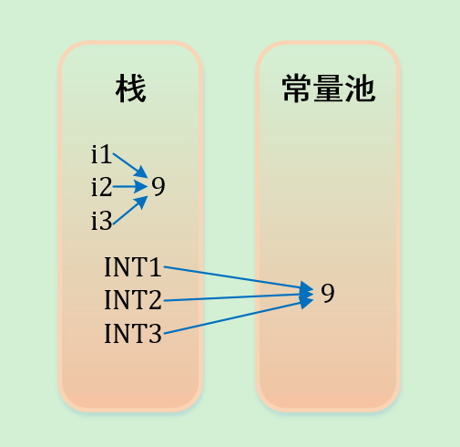

###字符串常量池

> 字符串的分配，和其他的对象分配一样，耗费高昂的时间与空间代价。JVM为了提高性能和减少内存开销，在实例化字符串常量的时候进行了一些优化。为 了减少在JVM中创建的字符串的数量，字符串类维护了一个字符串池，每当代码创建字符串常量时，JVM会首先检查字符串常量池。如果字符串已经存在池中， 就返回池中的实例引用。如果字符串不在池中，就会实例化一个字符串并放到池中。Java能够进行这样的优化是因为字符串是不可变的，可以不用担心数据冲突 进行共享。字符串常量池有助于为Java运行时节省大量空间，虽然创建字符串时需要更多的时间。

- 当我们使用双引号创建一个字符串时，首先在字符串常量池中查找是否有相同值的字符串，如果发现则返回其引用，否则它会在池中创建一个新的字符串，然后返回新字符串的引用。

- 如果使用new运算符创建字符串，会先去常量池中查找是否已经有了“XX”对象，如果没有则在常量池中创建一个此字符串对象，然后堆中再创建一个常量池中此”XX”对象的拷贝对象


```
String str = new String("Cat");  
```

在上面的语句中，可能创建1或2个字符串对象。如果池中已经有一个字符串*“Cat”*，那么池中只会创建一个字符串*“str”*。如果池中没有字符串字面量*“Cat”*，那么它将首先在池中创建，然后在堆空间中创建，因此将创建总共2个字符串对象。

示例：

```java
String s0= "kvill";   
        String s1=new String("kvill");   
        String s2=new String("kvill");   
        System.out.println( s0==s1 );     
        s1.intern();   
        s2=s2.intern(); //把常量池中"kvill"的引用赋给s2   
        System.out.println( s0==s1);   
        System.out.println( s0==s1.intern() );   
        System.out.println( s0==s2 );
```

输出结果：

false
false
true
true


```java
【1】
String a = "ab";   
String bb = "b";   
String b = "a" + bb;   
System.out.println((a == b)); //result = false 

【2】
String a = "ab";   
final String bb = "b";   
String b = "a" + bb;   
System.out.println((a == b)); //result = true 

【3】
String a = "ab";   
final String bb = getBB();   
String b = "a" + bb;   
System.out.println((a == b)); //result = false   
private static String getBB() {  
return "b";   
}
```

分析：

　　【1】中，JVM对于字符串引用，由于在字符串的"+"连接中，有字符串引用存在，而引用的值在程序编译期是无法确定的，即"a" + bb无法被编译器优化，只有在程序运行期来动态分配并将连接后的新地址赋给b。所以上面程序的结果也就为false。

　　【2】和【1】中唯一不同的是bb字符串加了final修饰，对于final修饰的变量，它在编译时被解析为常量值的一个本地拷贝存储到自己的常量池中或嵌入到它的字节码流中。所以此时的"a" + bb和"a" + "b"效果是一样的。故上面程序的结果为true。

　　【3】JVM对于字符串引用bb，它的值在编译期无法确定，只有在程序运行期调用方法后，将方法的返回值和"a"来动态连接并分配地址为b，故上面程序的结果为false。

---

###基础类型的变量和常量在内存中的分配

对于基础类型的变量和常量，变量和引用存储在栈中，常量存储在常量池中。

```java
int i1 = 9;
int i2 = 9;
int i3 = 9;

final int INT1 = 9;
final int INT2 = 9;
final int INT3 = 9;
```



编译器先处理int i1 = 9；首先它会在栈中创建一个变量为i1的引用，然后查找栈中是否有9这个值，如果没找到，就将9存放进来，然后将i1指向9。接着处理int i2 = 9；在创建完i2的引用变量后，因为在栈中已经有9这个值，便将i2直接指向9。这样，就出现了i1与i2同时均指向9的情况。最后i3也指向这个9。

---

### 成员变量和局部变量在内存中的分配

对于成员变量和局部变量：成员变量就是方法外部，类的内部定义的变量；局部变量就是方法或语句块内部定义的变量。局部变量必须初始化。 形式参数是局部变量，局部变量的数据存在于栈内存中。栈内存中的局部变量随着方法的消失而消失。 成员变量存储在堆中的对象里面，由垃圾回收器负责回收。

```java
class BirthDate {
    private int day;
    private int month;
    private int year;

    public BirthDate(int d, int m, int y) {
        day = d;
        month = m;
        year = y;
    }
    // 省略get,set方法………
}

public class Test {
    public static void main(String args[]) {
        int date = 9;
        Test test = new Test();
        test.change(date);
        BirthDate d1 = new BirthDate(7, 7, 1970);
    }

    public void change(int i) {
        i = 1234;
    }
}
```

对于以上这段代码，date为局部变量，i,d,m,y都是形参为局部变量，day，month，year为成员变量。下面分析一下代码执行时候的变化：    

1. main方法开始执行：int date = 9; date局部变量，基础类型，引用和值都存在栈中。
2. Test test = new Test();test为对象引用，存在栈中，对象(new Test())存在堆中。 
3. test.change(date);  i为局部变量，引用和值存在栈中。当方法change执行完成后，i就会从栈中消失。
4. BirthDate d1= new BirthDate(7,7,1970); d1为对象引用，存在栈中，对象(new BirthDate())存在堆中，其中d，m，y为局部变量存储在栈中，且它们的类型为基础类型，因此它们的数据也存储在栈中。day,month,year为成员变量，它们存储在堆中(new BirthDate()里面)。当BirthDate构造方法执行完之后，d,m,y将从栈中消失。 
5. main方法执行完之后，date变量，test，d1引用将从栈中消失，new Test(), new BirthDate()将等待垃圾回收。